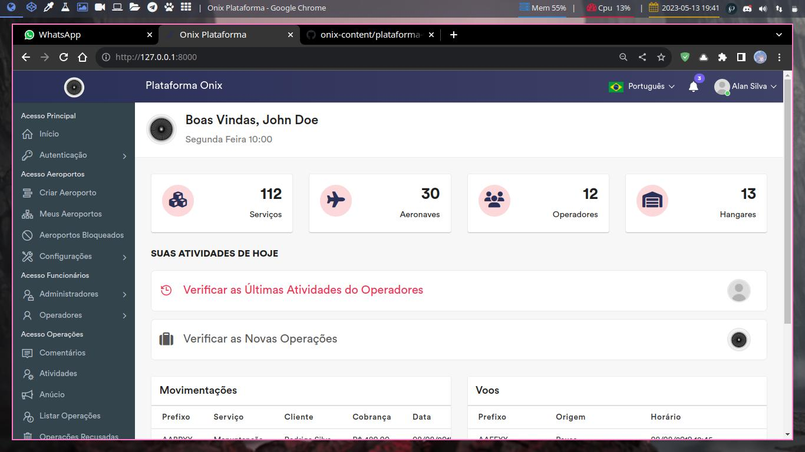

Onix é uma plataforma web para gerenciamento de aeroportos brasileiros. Contendo recursos para o gerenciamento de multiplos aeroportos com suas próprias aeronaves.

## Descrição Do Projeto

Onix contém a capacidade de lidar com várias requisições ao mesmo tempo. sabendo a movimentação das aeronaves, o sistema pode controlar qual o devido funcionamento dos serviços designados aos hangares, gerando relatórios precisos para cada tipo de usabilidade.

## Fundadores Do Projeto

|  |
| :------------------------------------------------------------------------------------------------------------------------: |

| [Alan Silva](https://github.com/akicodeoficial)

## Aplicações de Micro Serviços

- [ ] Plataforma web.
- [ ] Aplicativo Desktop Simulações.
